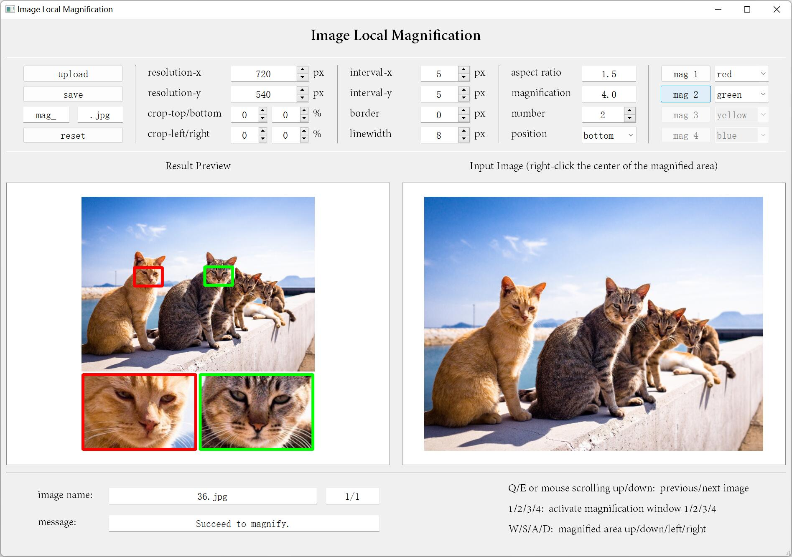

# Image_Local_Magnification_Tool
A tool to magnify the local areas of images.



# Requirements:

PyQt5, numpy, cv2

# Usage:

run `main.bat` on Windows or
```
python main.py
```


- `upload` : upload one or several images; upload checkpoint file (".json") to restore previous settings
- `save` : choose the diretory to save results and checkpoint file
  - `prefix` : text added to the beginning of the original image name (e.g. "mag_")
  - `suffix` : image file format added to the end of the original image name (e.g. ".jpg")
- `reset` : reset all settings
- `resolution-x/y` (range: 128~4096px, aspect ratio is preserved): resolution of the processed image (do not consider the magnification windows)
- `crop top/bottom/left/down` (range: 0~80%): crop ratio
- `interval-x/y` (can be negative): distance between the original image and magnification windows or distance between the adjacent magnification windows (denotes relative offset when the number of magnification windows is set to 1)
- `border` (can be negative): distance between the boundary of the magnification windows and that of the original image
- `linewidth` : boundary line width of the magnification windows
- `aspect ratio` (range: 0.2~5.0): aspect ratio of the magnification windows
- `magnification` (range: 1.0~10.0): magnification scale
- `number` (range: 0~4): number of the magnification windows
- `position`: position of the magnification windows
- `mag 1/2/3/4` : push the button to activate different magnification windows
- `color 1/2/3/4` (default color or hex color codes): boundary line color of the magnification windows
- `keyboard Esc` : remove focus for all widgets
- `keyboard Q/E` : switch to other uploaded images (conditioned on removing focus)
- `keyboard W/S/A/D` : fine-tune the position of the magnified area (conditioned on removing focus)
- `keyboard 1/2/3/4` : activate different magnification windows (conditioned on removing focus)

After activating one magnification window, you can click the center of the magnified area in the left image to determine where to magnifiy. If the size or position of the magnified area exceeds the range of the whole image, the corresponding magnification window will not display.

If you encounter any bug or have any advice, please feel free to create an issue.